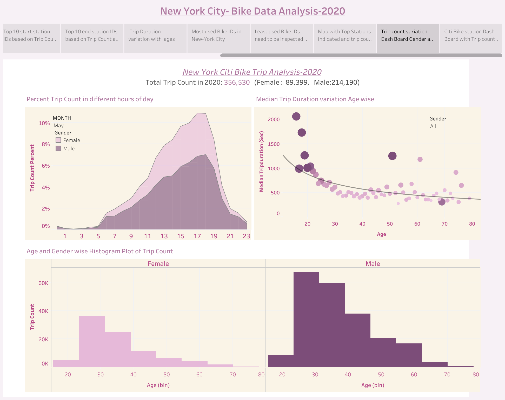
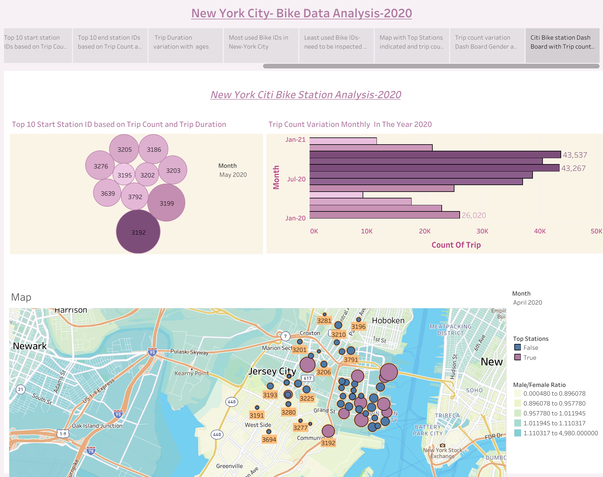
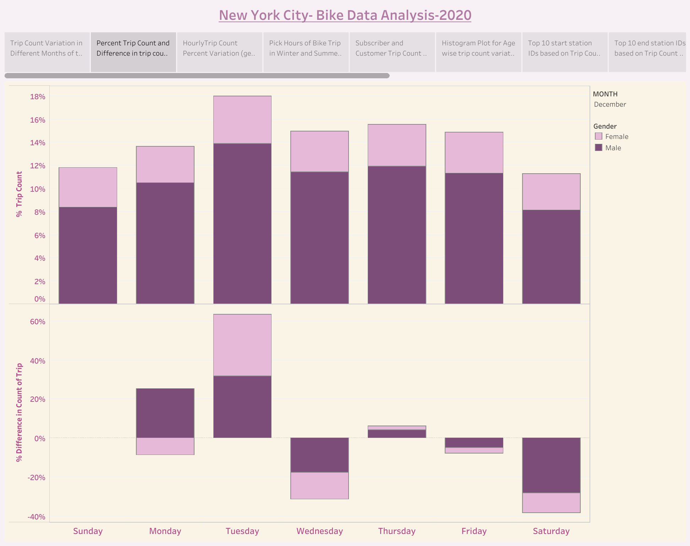

# NY Citi Bike Analytics

## Background

Since 2013, the NY Citi Bike Program has implemented a robust infrastructure for collecting data on the program's utilization. Through their team's efforts, each month bike data is collected, organized, and made public on the [Citi Bike Data](https://www.citibikenyc.com/system-data) webpage.

Purpose of this project to build a set of data reports to provide following answers.

* How many trips have been recorded total during the chosen period?

* By what percentage has total ridership grown?

* How has the proportion of short-term customers and annual subscribers changed?

* What are the peak hours in which bikes are used during summer months?

* What are the peak hours in which bikes are used during winter months?

* Today, what are the top 10 stations in the city for starting a journey? (Based on data, why do you hypothesize these are the top locations?)

* Today, what are the top 10 stations in the city for ending a journey? (Based on data, why?)

* Today, what are the bottom 10 stations in the city for starting a journey? (Based on data, why?)

* Today, what are the bottom 10 stations in the city for ending a journey (Based on data, why?)

* Today, what is the gender breakdown of active participants (Male v. Female)?

* How effective has gender outreach been in increasing female ridership over the timespan?

* How does the average trip duration change by age?

* Which bikes (by ID) are most likely due for repair or inspection in the timespan?

## Images

### Contact Info:
* email id : tamasree.g@gmail.com
* linkedin : https://www.linkedin.com/in/tamasree-sinha/